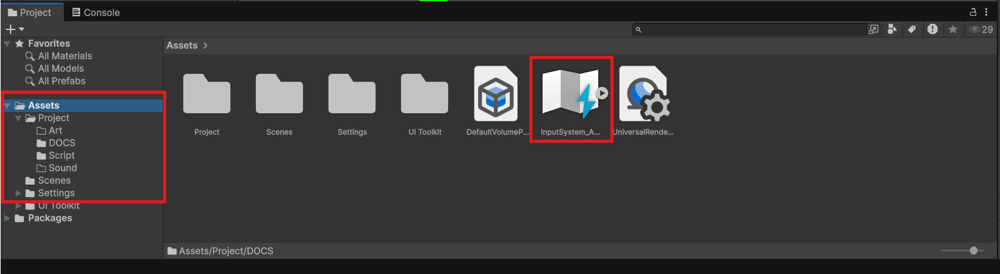
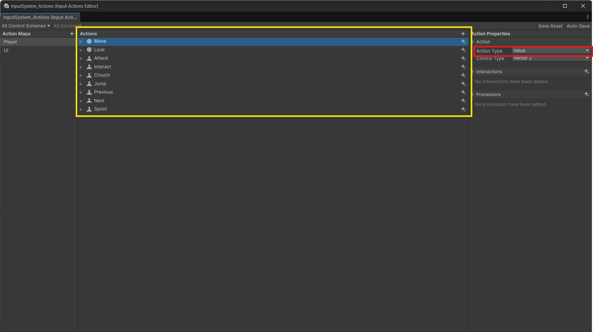
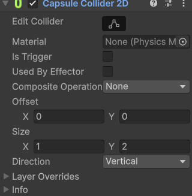
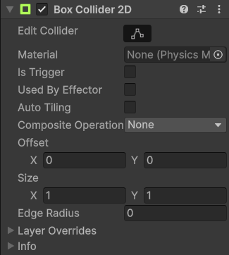
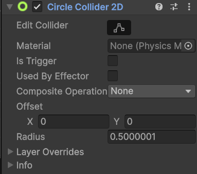
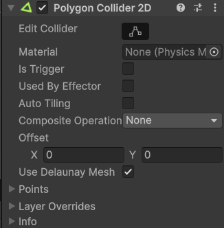
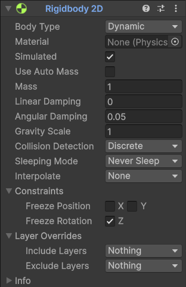

# Bài 3 #
## I. Tóm tắt bài cũ ##
### 1. NewInputSystem ###
- Sử dụng file InputSystem_Acions ở thư mục Assets (có thể file nằm ở thư mục Settings nếu dùng phiên bản unity mới hơn).

	
	
- Action (Khung màu vàng): Một lệnh nhập liệu logic đại diện cho một hành động của người chơi trong game (như "Nhảy", "Bắn" hay "Di chuyển").
- Action Type (Khung màu đỏ): Thuộc tính dùng để định nghĩa cách mà hệ thống xử lý sự kiện và giá trị đầu vào cho một hành động
	+ Value: Là loại mặc định, dành cho các giá trị thay đổi liên tục theo thời gian. Phù hợp cho cần điều khiển (joystick), di chuyển (WASD), xoay camera. Có cơ chế giải quyết xung đột (conflict resolution) khi nhiều phím cùng được giữ, hệ thống sẽ chọn phím có tác động mạnh nhất.
	+ Button: Dành cho các phím bấm bật/tắt (on/off) rời rạc. Phù hợp cho hành động như nhảy (Jump), bắn (Fire), tương tác (Interact). Cung cấp các trạng thái rõ ràng: started, performed, canceled.
	+ Pass-Through: Tương tự như Value nhưng không thực hiện cơ chế lọc hay chọn ưu tiên. Mọi thay đổi từ bất kỳ phím/cần gạt nào được gán đều kích hoạt sự kiện ngay lập tức. Phù hợp để theo dõi toàn bộ dữ liệu đầu vào cùng lúc (thường dùng cho hệ thống UI Click hoặc đa thiết bị).

	
	
- Script để áp dụng InputSystem lên nhân vậy:
```
using UnityEngine;
using UnityEngine.InputSystem; // Sử dụng thư viện Input System mới của Unity

public class Player : MonoBehaviour
{
    // [SerializeField] cho phép chỉnh sửa giá trị biến trong Inspector của Unity mà vẫn giữ biến ở dạng private
    [SerializeField] private float m_MoveSpeed = 15.0f; // Tốc độ di chuyển ngang
    [SerializeField] private float m_JumpForce = 5.0f; // Lực nhảy

    private Rigidbody2D m_Rigidbody; // Tham chiếu đến thành phần vật lý 2D

    // Khai báo các tham chiếu đến Input Action trong New Input System
    private InputAction m_MoveAction;
    private InputAction m_JumpAction;
    private InputAction m_ATK;

    private float m_MoveInput; // Lưu giá trị đầu vào cho việc di chuyển (-1: trái, 1: phải, 0: đứng yên)

    private void Awake()
    {
        // Hàm Awake chạy đầu tiên khi Script được tải
        // Tìm và lưu lại các hành động (Action) từ Input Manager toàn cục của Unity
        m_MoveAction = InputSystem.actions.FindAction("Move");
        m_JumpAction = InputSystem.actions.FindAction("Jump");
        m_ATK = InputSystem.actions.FindAction("ATK");
    }

    private void Start()
    {
        // Lấy thành phần Rigidbody2D được gắn trên cùng GameObject này
        m_Rigidbody = GetComponent<Rigidbody2D>();
    }

    private void Update()
    {
        // Update chạy mỗi frame - Dùng để đọc Input và xử lý các sự kiện không phụ thuộc vào vật lý

        // 1. Đọc giá trị di chuyển ngang từ Input Action (trả về kiểu float từ -1.0 đến 1.0)
        m_MoveInput = m_MoveAction.ReadValue<float>();

        // 2. Xử lý logic Nhảy (Jump)
        // Kiểm tra phím Jump có vừa mới được ấn xuống trong frame này không
        if (m_JumpAction.WasPressedThisFrame())
        {
            Debug.Log("Jump Pressed");
            Jump();
        }

        // Kiểm tra xem phím Jump có đang được giữ hay không
        if (m_JumpAction.IsPressed())
        {
            Debug.Log("Jump Hold");
        }

        // Kiểm tra phím Jump vừa mới được thả ra trong frame này
        if (m_JumpAction.WasReleasedThisFrame())
        {
            Debug.Log("Jump Release");
        }

        // 3. Xử lý logic Tấn công (ATK)
        if (m_ATK.WasPressedThisFrame())
        {
            Debug.Log("Attacked");
        }
    }

    private void FixedUpdate()
    {
        // FixedUpdate chạy cố định theo thời gian vật lý (mặc định 50 lần/giây)
        // Mọi thao tác làm thay đổi lực, vận tốc của Rigidbody nên đặt ở đây

        // Cập nhật vận tốc (linearVelocity) cho nhân vật:
        // - Trục X: Bằng hướng đầu vào (m_MoveInput) * Tốc độ (m_MoveSpeed)
        // - Trục Y: Giữ nguyên vận tốc Y hiện tại (để không can thiệp vào trọng lực hay lực nhảy)
        m_Rigidbody.linearVelocity = new Vector2(m_MoveInput * m_MoveSpeed, m_Rigidbody.linearVelocity.y);
    }

    private void Jump()
    {
        // Tác dụng một lực tức thời (Impulse) hướng lên trên để nhân vật nảy lên
        m_Rigidbody.AddForce(Vector2.up * m_JumpForce, ForceMode2D.Impulse);
    }
}
```
### 2. Physic 2D ###
- Collider 2D: là thành phần định nghĩa ranh giới hình học của một đối tượng (GameObject) để phát hiện và xử lý va chạm trong không gian hai chiều (trục X và Y). Bao gồm:

|  | |
| :---: | :---: |
| Capsule Collider 2D | Box Collider 2D |
|  |  |
| Capsule Collider 2D | Polygon Collider 2D |

- Rigidbody 2D: là thành phần vật lý trong Unity Manual giúp đối tượng chịu ảnh hưởng của trọng lực và các lực va chạm. Giúp GameObject di chuyển, rơi và tương tác vật lý với các Collider 2D khác. Rigidbody 2D tự động cập nhật tọa độ (position) và góc xoay (rotation) của đối tượng sau mỗi chu kỳ mô phỏng vật lý.



- Thông tin:
	+ Body Type: 
		* Dynamic: Chịu toàn bộ tác động của lực, trọng lực và va chạm.
		* Kinematic: Di chuyển qua mã nguồn (script), không bị tác động bởi trọng lực hay lực đẩy từ bên ngoài.
		* Static: Không di chuyển, dùng cho các vật cố định như mặt đất hoặc tường.
	+ Mass: Khối lượng của vật thể.
	+ Gravity Scale: Hệ số nhân trọng lực tác động lên đối tượng.
	+ Collision Detection: Tùy chỉnh phát hiện va chạm (Discrete hoặc Continuous).
	+ Sleep mode: 
		* Never Sleep: Không bao giờ ngủ. Vật thể luôn luôn được tính toán vật lý mỗi khung hình (gây tốn hiệu năng hơn, chỉ dùng khi bắt buộc).
		* Start Awake: Vật thể bắt đầu ở trạng thái tỉnh táo khi game mới chạy, sau đó có thể đi ngủ nếu đứng yên.
		* Start Asleep: Vật thể bắt đầu game ở trạng thái ngủ ngay lập tức cho đến khi có lực hoặc va chạm kích hoạt nó dậy (rất tốt để tối ưu các vật thể tĩnh chờ kích hoạt).
### 3. Di chuyển ###
- Transforms: 
```
using UnityEngine;
using UnityEngine.InputSystem;

public class PlayerMovementTransform : MonoBehaviour
{
    [SerializeField] private float m_MoveSpeed = 10.0f;

    private InputAction m_MoveAction;
    private float m_MoveInput;

    private void Awake()
    {
        m_MoveAction = InputSystem.actions.FindAction("Move");
    }

    private void Update()
    {
        m_MoveInput = m_MoveAction.ReadValue<float>();
        transform.Translate(Vector3.right * m_MoveInput * m_MoveSpeed * Time.deltaTime);
    }
}
```
- MovePosition:
```
using UnityEngine;
using UnityEngine.InputSystem;

public class PlayerMovementMovePosition : MonoBehaviour
{
    [Header("Movement Settings")]
    [SerializeField] private float m_MoveSpeed = 10.0f;

    private Rigidbody2D m_Rigidbody;
    private InputAction m_MoveAction;
    private float m_MoveInput;

    private void Awake()
    {
        m_MoveAction = InputSystem.actions.FindAction("Move");
    }

    private void Start()
    {
        m_Rigidbody = GetComponent<Rigidbody2D>();
    }

    private void Update()
    {
        m_MoveInput = m_MoveAction.ReadValue<float>();
    }

    private void FixedUpdate()
    {
        Vector2 targetPosition = m_Rigidbody.position + new Vector2(m_MoveInput * m_MoveSpeed * Time.fixedDeltaTime, 0f);
        m_Rigidbody.MovePosition(targetPosition);
    }
}
```
- AddForce:
```
using UnityEngine;
using UnityEngine.InputSystem;

public class PlayerMovementPureAddForce : MonoBehaviour
{
    [SerializeField] private float m_MoveForce = 20.0f;
    [SerializeField] private float m_JumpForce = 5.0f; 

    private Rigidbody2D m_Rigidbody;
    private InputAction m_MoveAction;
    private InputAction m_JumpAction;
    private float m_MoveInput;

    private void Awake()
    {
        m_MoveAction = InputSystem.actions.FindAction("Move");
        m_JumpAction = InputSystem.actions.FindAction("Jump");
    }

    private void Start()
    {
        m_Rigidbody = GetComponent<Rigidbody2D>();
    }

    private void Update()
    {
        m_MoveInput = m_MoveAction.ReadValue<float>();

        if (m_JumpAction.WasPressedThisFrame())
        {
            Jump();
        }
    }

    private void FixedUpdate()
    {
        m_Rigidbody.AddForce(new Vector2(m_MoveInput * m_MoveForce, 0f), ForceMode2D.Force);
    }

    private void Jump()
    {
        m_Rigidbody.AddForce(Vector2.up * m_JumpForce, ForceMode2D.Impulse);
    }
}
```
- LinearVelocity:
```
using UnityEngine;
using UnityEngine.InputSystem;

public class PlayerMovementLinearVelocity : MonoBehaviour
{
    [Header("Movement Settings")]
    [SerializeField] private float m_MoveSpeed = 10.0f;
    [SerializeField] private float m_JumpForce = 7.0f; 

    private Rigidbody2D m_Rigidbody;
    private InputAction m_MoveAction;
    private InputAction m_JumpAction;

    private float m_MoveInput;
    private bool m_JumpRequested;

    private void Awake()
    {
        m_MoveAction = InputSystem.actions.FindAction("Move");
        m_JumpAction = InputSystem.actions.FindAction("Jump");
    }

    private void Start()
    {
        m_Rigidbody = GetComponent<Rigidbody2D>();
    }

    private void Update()
    {
        m_MoveInput = m_MoveAction.ReadValue<float>();

        if (m_JumpAction.WasPressedThisFrame())
        {
            m_JumpRequested = true;
        }
    }

    private void FixedUpdate()
    {
        Vector2 currentVelocity = m_Rigidbody.linearVelocity;

        currentVelocity.x = m_MoveInput * m_MoveSpeed;

        if (m_JumpRequested)
        {
            currentVelocity.y = m_JumpForce; 
            m_JumpRequested = false;         
        }

        m_Rigidbody.linearVelocity = currentVelocity;
    }
}
```
## II. Bài mới ##
### 1. Trigger ###
- Trigger trong Unity là một vùng không gian Collider được thiết lập cho phép các đối tượng đi xuyên qua nhau nhưng vẫn phát hiện ra thời điểm tiếp xúc để kích hoạt sự kiện.
- Cách hoạt động cơ bản: 
	+ Không cản trở vật lý: Đối tượng khác sẽ đi xuyên qua Trigger chứ không bị nảy ra hay chặn lại.
	+ Điều kiện: Ít nhất một trong hai đối tượng phải có thành phần Rigidbody (hoặc ArticulationBody) và bật tùy chọn Is Trigger trên Collider.
- Các hàm sự kiện chính (Trigger Methods):
	+ OnTriggerEnter(Collider other): Gọi một lần khi đối tượng bắt đầu đi vào vùng Trigger.
	+ OnTriggerStay(Collider other): Gọi liên tục mỗi khung hình khi đối tượng vẫn đang ở bên trong vùng Trigger.
	+ OnTriggerExit(Collider other): Gọi một lần khi đối tượng đi ra khỏi vùng Trigger.
- Nếu không tích chọn "Is Trigger", các đối tượng sẽ va chạm, nảy ra hoặc chặn nhau lại (như quả bóng đập vào tường). Lúc này sẽ sử dụng bộ hàm OnCollision:
	+ OnCollisionEnter(Collision collision): Gọi một lần ngay khi hai đối tượng bắt đầu chạm vào nhau.
	+ OnCollisionStay(Collision collision): Gọi liên tục mỗi khung hình khi hai đối tượng vẫn đang tiếp xúc.
	+ OnCollisionExit(Collision collision): Gọi một lần ngay khi hai đối tượng tách nhau ra.
- Nếu làm game 2D và sử dụng các thành phần như Rigidbody 2D và Collider 2D thì chỉ cần thêm chữ 2D vào cuối tên các hàm:
	+ Khi bật "Is Trigger" trong 2D: <br>
		OnTriggerEnter2D(Collider2D other) <br>
		OnTriggerStay2D(Collider2D other) <br>
		OnTriggerExit2D(Collider2D other) <br>
	+ Khi va chạm vật lý thông thường trong 2D: <br>
		OnCollisionEnter2D(Collision2D collision) <br>
		OnCollisionStay2D(Collision2D collision) <br>
		OnCollisionExit2D(Collision2D collision) <br>
		
| Đặc điểm | Bộ hàm Trigger | Bộ hàm Collision |
| --- | --- | --- |
| Xuyên qua |Có (Đi xuyên qua nhau)|Không (Bị cản lại/Đẩy ra)|
|Tham số truyền vào| Trả về Collider (Chỉ biết đối tượng đó là ai)|Trả về Collision (Chứa thêm thông tin lực va chạm, điểm tiếp xúc contacts)|
|Hiệu năng|Nhẹ hơn, xử lý nhanh hơn|Nặng hơn do phải tính toán lực vật lý|
### 2. Raycast 2D ###
- Raycast 2D trong Unity là một phương thức vật lý dùng để bắn một tia thẳng (ray) từ một điểm trong không gian 2D theo một hướng nhất định nhằm phát hiện các đối tượng có chứa thành phần va chạm (Collider2D).
- Nguyên lý hoạt động:
	+ Điểm xuất phát (Origin): Vị trí bắt đầu bắn tia (ví dụ: vị trí nhân vật).
	+ Hướng (Direction): Hướng mà tia di chuyển tới (ví dụ: hướng nhìn của nhân vật).
	+ Khoảng cách (Distance): Chiều dài tối đa của tia.
	+ Kết quả: Trả về thông tin của đối tượng đầu tiên mà tia cắt qua (RaycastHit2D), giúp biết đối tượng đó là gì, vị trí va chạm ở đâu.
- Ứng dụng phổ biến:
	+ Kiểm tra mặt đất (Grounded Check): Xem nhân vật đang đứng trên mặt đất hay đang nhảy trên không.
	+ Bắn súng / Tấn công: Xác định viên đạn hoặc đòn đánh trúng kẻ địch nào.
	+ Tương tác chuột (Click/Tap): Phát hiện người chơi bấm vào vật phẩm nào trên màn hình 2D.
	+ Tầm nhìn của AI (Line of Sight): Kiểm tra xem kẻ địch có nhìn thấy người chơi hay bị vách ngăn che khuất.
- Ví dụ:
```
// Bắn một tia từ vị trí hiện tại sang bên phải, khoảng cách là 5 đơn vị
RaycastHit2D hit = Physics2D.Raycast(transform.position, Vector2.right, 5f);

if (hit.collider != null) {
    // Đã va chạm với đối tượng
    Debug.Log("Đã bắn trúng: " + hit.collider.name);
}
```
### 3. Layer mask ###
- Layer Mask trong Unity là một bộ lọc dùng để chọn hoặc loại trừ các Layer (lớp đối tượng) cụ thể khi thực hiện các tác vụ như render hình ảnh (Camera Culling Mask) hoặc kiểm tra va chạm (Raycast, Physics).
- Ý nghĩa và Công dụng:
	+ Giới hạn Camera (Culling Mask): Quyết định xem Camera sẽ hiển thị (vẽ) những đối tượng thuộc Layer nào và bỏ qua Layer nào.
	+ Lọc va chạm vật lý (Physics/Raycast): Giúp hàm kiểm tra va chạm chỉ quét các đối tượng ở Layer định sẵn (ví dụ: chỉ va chạm với môi trường, bỏ qua nhân vật) để tối ưu hiệu năng.
	+ Cách hoạt động: Layer Mask hoạt động dưới dạng mặt nạ bit (bitmask) trong lập trình, cho phép gộp nhiều Layer lại với nhau trong một biến duy nhất.
